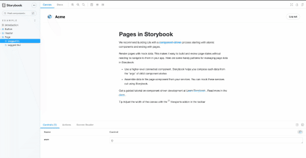

# Storybook Screen Reader Addon

[](https://storybook-screen-reader.netlify.app/?path=/story/example-page--logged-in)
[](https://www.npmjs.com/package/addon-screen-reader)
[](https://snyk.io/test/github/vlaraort/addon-screen-reader)
[](https://snyk.io/test/github/vlaraort/addon-screen-reader)

[](https://app.netlify.com/sites/storybook-screen-reader/deploys)


Addon to display a custom screen reader in the addons panel of Storybook. Allows the developers to quickly test their accessibility without need of external screen reader or complex programs.

It allows to have separate outputs for voice and text.



## Disclaimer

This is a starting project with a lot of things to improve.

Only a few use cases of screen readers and keyboard navigation are covered and is not intended to replace a full test with a real screen reader.

This is a personal project, while I am improving myself in accessibility topics, to help me to understand in deep how a screen reader works, and there is no better way than try to build one by myself right? 

## Installation

Just like any regular NPM package.

Install as a dev dependency:

```bash
npm install -d addon-screen-reader
```

or

```bash
yarn add -dev addon-screen-reader
```


Add the addon to your addons file (usually `.storybook/main.js`)

```
module.exports = {
  addons: ['addon-screen-reader'],
};
```

## Usage

- Run the storybook of your project.
- Navigate to the new "Screen Reader" tab.
- Enable the voice / text option.
- Navigate though your page with <kbd>Alt</kbd> + <kbd>Tab</kbd> or <kbd>Option</kbd> + <kbd>Tab</kbd>.


## Demo

The CI integration of this project deploys a demo storybook in netlify, so you can check by yourself.

[Demo](https://storybook-screen-reader.netlify.app/?path=/story/example-page--logged-in)

## Feedback

All the feedback is welcome! You can create any issue in the repository and I will reach you ASAP.

## Contributing

You want to contribute? yay! 

Just fork this project and open a PR, I will help you in what you need.
